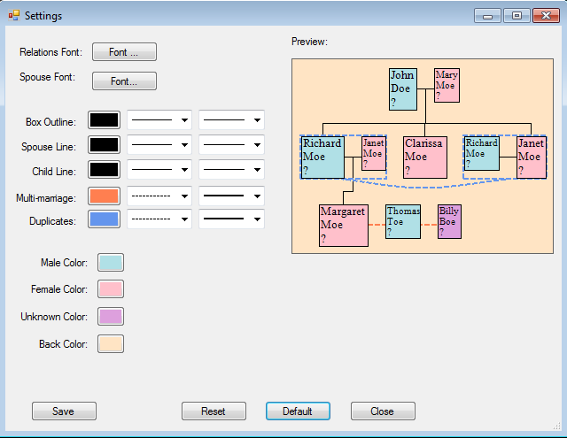

# Ancestral-Tree
Graphical family tree drawing program for GEDCOM (genealogy).

Load a GEDCOM file and view all the descendants of any person in the file. Lots of configuration options.

The main application window as of 30 JUL 2018 showing part of Abraham Lincoln's tree:

The settings dialog as of 30 JUL 2018: a mock tree is shown and updated live as changes are made:

Current features:
1. View descendants of any person.
2. Zoom in / out.
3. Multiple configuration options.
4. Save to image.

Future plans may include:
1. View ancestors of any person.
2. Vertical orientation ('main' person on left).
3. Control number of generations shown.
4. Print, print-preview to multiple pages.
5. Toggle display of multiple-marriages, duplicate-nodes.
6. Collapse portions of the tree.
7. Navigate to people via the tree.
8. A more polished user interface.
9. Documentation: user and developer.

This program is both a demo of my GEDCOM library: [YAGP](https://github.com/user/fire-eggs/yagp), and a hopefully useful program in itself.

References:
- Heavily based on the .NET port of Abego Treelayout [link](https://sourceforge.net/projects/citexplore-code-treelayout/).
- Inspirations from [GEDKeeper](https://github.com/Serg-Norseman/GEDKeeper) and [GenealogyJ](https://genj.sourceforge.net).
