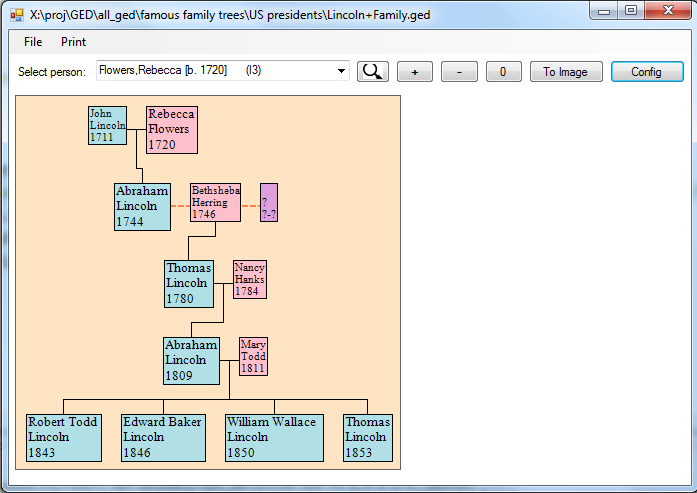
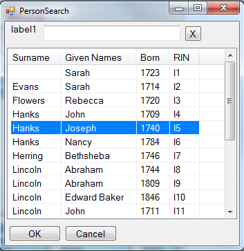

# Ancestral-Tree
Graphical family tree drawing program for GEDCOM (genealogy).

Load a GEDCOM file and view all the descendants of any person in the file. Lots of configuration options. People search. Preview and 
print to multiple pages.

V0.1 released! See the Releases tab to download. Requires .NET V4.5.

The main application window as of V0.1 showing part of Abraham Lincoln's tree:

The settings dialog as of V0.1: a mock tree is shown and updated live as changes are made:

The person search dialog as of V0.1: filter on names or date of birth:

Current features:
1. View descendants of any person.
2. Zoom in / out.
3. Multiple configuration options.
4. Save to image.
5. Preview and print to multiple pages.
6. Search for people, filtering on names, birth date.
7. Navigate to people via the tree.

Future plans may include:
1. View ancestors (pedigree) of any person.
2. Vertical orientation ('main' person on left).
3. Control number of generations shown.
5. Toggle display of multiple-marriages, duplicate-nodes.
6. Collapse portions of the tree.
8. A more polished user interface.
9. Documentation: user and developer.
1. Internationalization.

This program is both a demo of my GEDCOM library: [YAGP](https://github.com/user/fire-eggs/yagp), and a hopefully useful program in itself.

References:
- Heavily based on the .NET port of Abego Treelayout [link](https://sourceforge.net/projects/citexplore-code-treelayout/).
- Inspirations from [GEDKeeper](https://github.com/Serg-Norseman/GEDKeeper) and [GenealogyJ](https://genj.sourceforge.net).
- Expands on the [Enhanced PrintPreviewDialog](https://www.codeproject.com/Articles/35838/An-Enhanced-PrintPreviewDialog)
